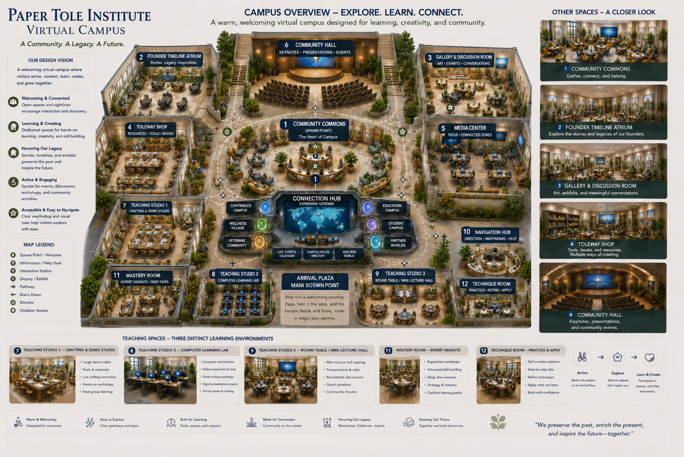
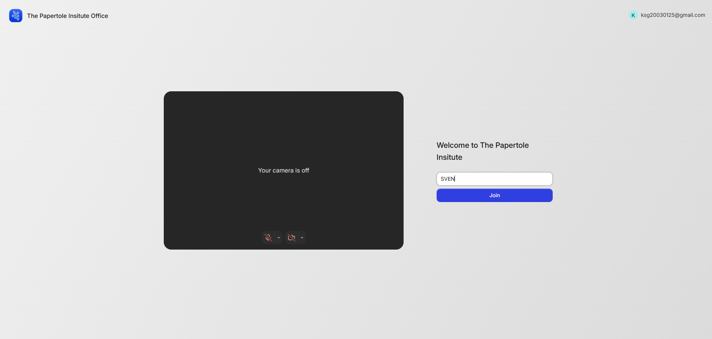
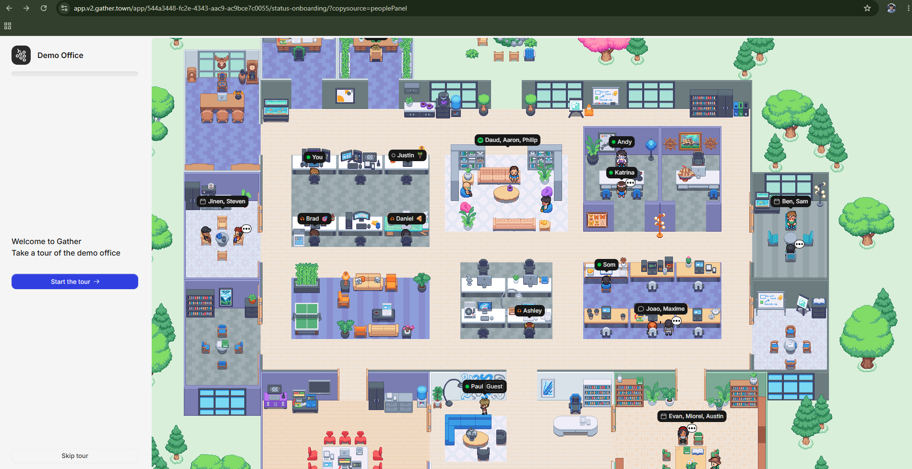
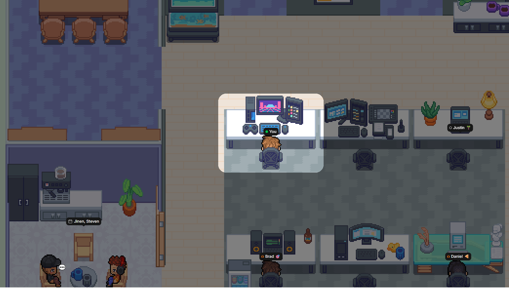
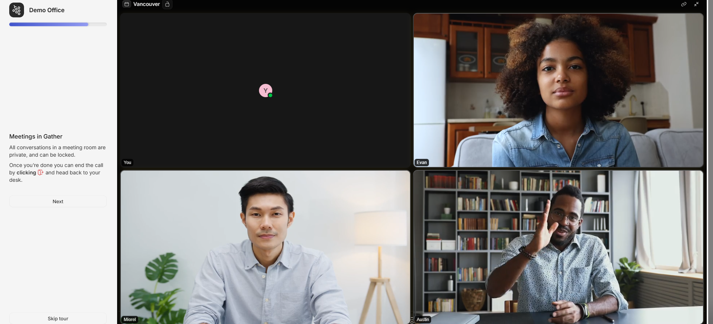

# 🪑 Have a Seat Universe — Virtual Campus

A warm, walkable **virtual community campus** for the **Paper Tole Institute** —
*"Pull up a seat — you belong here."*

This repo holds two things that work together:

1. **A live 3D prototype** — a real-time, walkable campus built in plain **HTML5 + Three.js**
   (no build step). It's the *visual blueprint* you can open in any modern browser.
2. **A Gather.town build kit** — step-by-step checklists for recreating the campus inside
   the client-owned **Gather.town** account, with portals, private audio zones, clickable
   objects, embedded forms, and external automations.

---

## 🖼️ Campus overview

The full campus design — explore, learn, connect. A community. A legacy. A future.



---

## ✨ The live 3D prototype

Walk the universe in real time. The central-park heart connects to learning & work
facilities, a seasonal village, a Christmas Tree Plaza, shopping district, event center,
and the First Down Football Club. Open `index.html` to explore it live in the browser.

### ▶ How to run it

**Option A — just open it**
Double-click `index.html` (opens via `file://`). Everything runs offline in the browser.

**Option B — local server (recommended for screen-sharing / phone testing)**
```bash
node serve.js
```
Then open **http://localhost:8080**. To test on a phone on the same Wi-Fi, open
`http://<your-computer-ip>:8080`.

### 🎮 Controls
- **Move:** `W` `A` `S` `D` or arrow keys (on-screen joystick on mobile)
- **Turn camera:** `Q` / `E`
- **Run:** `Shift`
- **Interact:** `F` at a glowing kiosk (opens links / forms)
- **Travel anywhere:** open the 🗺️ **Directory** in the top bar
- **Switch season:** 🍂 / ❄️ toggle in the top bar

---

## 🏛️ Inside the Gather.town build

The deliverable is built inside the client's Gather account using the Mapmaker — warm,
low-pressure, and community-focused for first-time visitors.

**Branded entry & the walkable campus:**

| | |
|---|---|
|  |  |

**Private audio zones & spatial video conversations:**

| | |
|---|---|
|  |  |

Everything in the 3D prototype has a 1:1 Gather feature:

- **Areas** → separate Gather **Maps** (or zones), connected by **Portals**.
- **Signs / popups** → objects with the **"Text"** interaction.
- **Kiosks / boards / screens** → objects with **"Embedded website"** or **"External link"**.
- **Embedded forms** → a Google Form / Airtable / Typeform set as an embedded website object.
- **Private meeting rooms** → Gather **Private Areas** (audio/video stays inside the room).
- **Spawn area** → the map's **Spawn tile**.
- **Automations** → Form → Google Sheet / Airtable → Zapier / Make for notifications.

---

## 📋 Build kit & checklists

Follow these top to bottom to build **Phase 1 — Foundational Universe Core**
(~3–5 hours for a clean pass):

- [`GATHER-BUILD-KIT.md`](GATHER-BUILD-KIT.md) — the complete plan & contract guardrails
- [`BUILD-CHECKLIST-01-Main-Spawn.md`](BUILD-CHECKLIST-01-Main-Spawn.md)
- [`BUILD-CHECKLIST-02-Connection-Hub.md`](BUILD-CHECKLIST-02-Connection-Hub.md)
- [`BUILD-CHECKLIST-03-Common-Ground.md`](BUILD-CHECKLIST-03-Common-Ground.md)
- [`BUILD-CHECKLIST-04-Community-Headquarters.md`](BUILD-CHECKLIST-04-Community-Headquarters.md)
- [`BUILD-CHECKLIST-05-Have-a-Seat-Legacy-Hall.md`](BUILD-CHECKLIST-05-Have-a-Seat-Legacy-Hall.md)
- [`BUILD-CHECKLIST-06-PTI-Legacy-Hall.md`](BUILD-CHECKLIST-06-PTI-Legacy-Hall.md)
- [`BUILD-CHECKLIST-07-Outdoor-Community-Areas.md`](BUILD-CHECKLIST-07-Outdoor-Community-Areas.md)
- [`BUILD-CHECKLIST-08-Beach-and-Park.md`](BUILD-CHECKLIST-08-Beach-and-Park.md)

---

## 🎨 Rebranding (2-minute edit)

Open `world.js` and edit the `LINKS` block near the top:
```js
const LINKS = {
  website:   "https://example.org",
  discord:   "https://discord.gg/your-invite",
  classroom: "https://meet.google.com/your-room",
  handbook:  "https://example.org/handbook",
  eventForm: "https://docs.google.com/forms/d/e/your-form/viewform?embedded=true",
};
```
Swap in the client's real links and forms and it instantly feels bespoke.

---

## 📁 Files

| File | Purpose |
|------|---------|
| `index.html` | Page shell, HUD, directory, intro overlay |
| `world.js` | The live 3D engine — scene, rooms, movement, camera, interactions |
| `style.css` | All styling (cozy, modern, responsive) |
| `game.js` / `campus.js` | Earlier 2D canvas prototype |
| `serve.js` | Optional tiny local static server |
| `vendor/` | Bundled Three.js (no CDN needed) |
| `image/` | Concept renders & Gather screenshots |
| `GATHER-BUILD-KIT.md` + `BUILD-CHECKLIST-*.md` | The Gather.town build plan |
</content>
</invoke>
